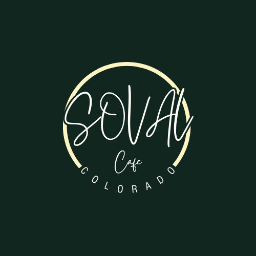

# SOVAL Cafe

A landing page and mobile app for SOVAL Cafe, showcasing coffee products, subscriptions, and brand story. Built using the MERN stack with React Native for web and mobile.

## Table of Contents
- [Features](#features)
- [Technologies](#technologies)
- [Setup](#setup)

## Features
- Responsive landing page
- Product catalog with coffee details
- Subscription and loyalty program
- Contact and newsletter signup
- Mobile-first design for React Native web & mobile

## Technologies
- MongoDB
- Express.js
- React Native (with React Native Web)
- Node.js
- Expo

## Setup
1. Clone the repo: git clone repository-URL
2. Install dependencies: npm install
3. Start the development server: npm start
